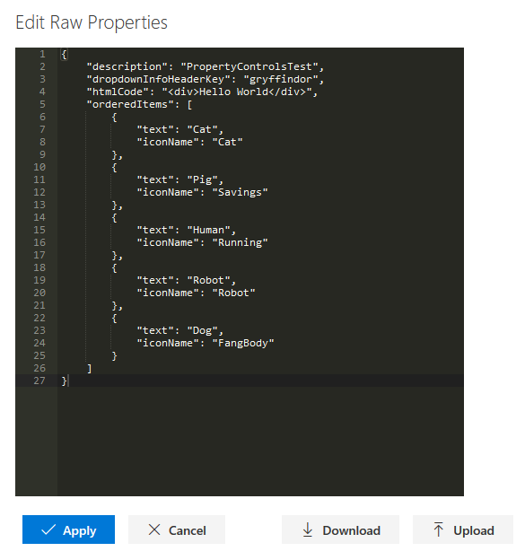

# PropertyEditor control

This control allows the user to edit the webpart properties in JSON. It can also be used to export properties of a webpart and later import them again to a similar webpart on a different page. If the user clicks 'export' a file named 'webpartproperties.json' is presented for download. The same file can be uploaded to a new instance of the same webpart on for instance another site or page.

**PropertyEditor rendering in property pane**


**PropertyEditor rendering when expanded**



## How to use this control in your solutions

1. Check that you installed the `@pnp/spfx-property-controls` dependency. Check out The [getting started](../#getting-started) page for more information about installing the dependency.
2. Import the following modules to your component: 

```TypeScript
import { PropertyWebPartInformation } from '@pnp/spfx-property-controls/lib/PropertyEditor';
```

3. Create a new property for your web part, for example:

```TypeScript
export interface IPropertyControlsTestWebPartProps {
  toggleInfoHeaderValue: boolean;
}
```

4. Add the custom property control to the `groupFields` of the web part property pane configuration:

```TypeScript
  PropertyEditor({
    webpart: this,
    key: 'propertyEditor'
  })    
```

## Implementation

The `PropertyEditor` control has the following properties:

| Property | Type | Required | Description |
| ---- | ---- | ---- | ---- |
| webpart | BaseClientSideWebPart | yes | The webpart, which is in principle the current webpart, of which you want to be able to edit the properties from |


