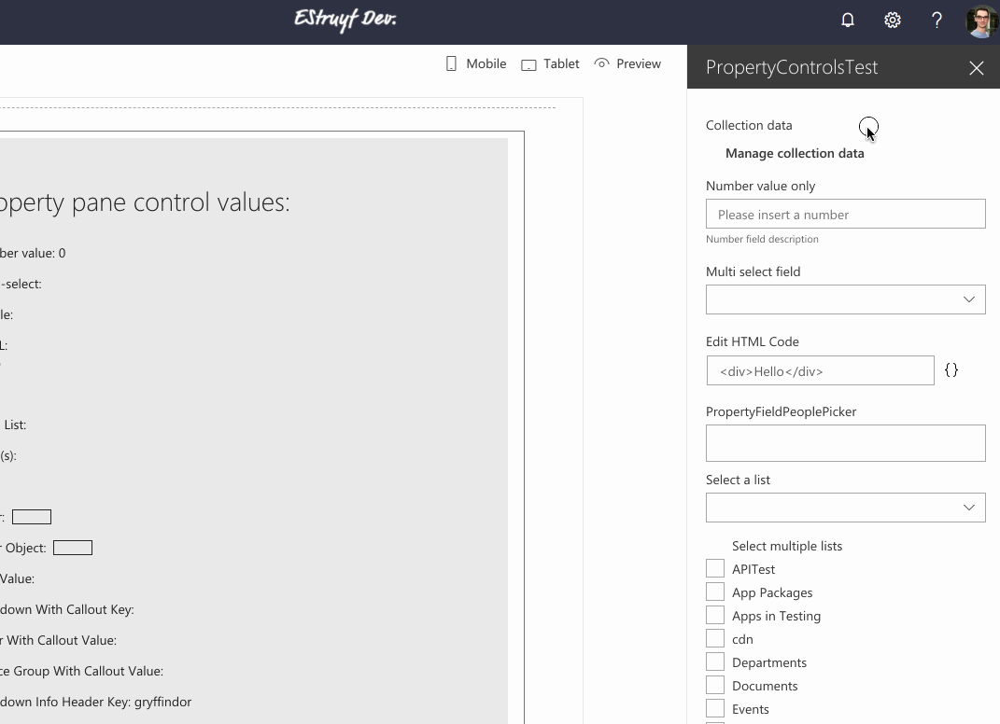

# PropertyFieldCollectionData control

This property field control gives you the ability to insert a list / collection data which can be used in your web part. For example: you want to specify multiple locations for showing a weather information.

The control allows you to specify multiple data types like: string, number, boolean, or dropdown.

**PropertyFieldCollectionData**



The type of data you get returned depends on the fields you defined. For the example above, the data looks like this:

```json
[
  {"Title":"Person","Lastname":"1","Age":"42","City":"helsinki","Sign":true},
  {"Title":"Person","Lastname":"2","Age":"42","City":"helsinki","Sign":true}
]
```

## How to use this control in your solutions

1. Check that you installed the `@pnp/spfx-property-controls` dependency. Check out The [getting started](../#getting-started) page for more information about installing the dependency.
2. Import the following modules to your component:

```TypeScript
import { PropertyFieldCollectionData, CustomCollectionFieldType } from '@pnp/spfx-property-controls/lib/PropertyFieldCollectionData';
```

3. Create a new property for your web part, for example:

```TypeScript
export interface IPropertyControlsTestWebPartProps {
  collectionData: any[];
}
```

4. Add the custom property control to the `groupFields` of the web part property pane configuration:

```TypeScript
PropertyFieldCollectionData("collectionData", {
  key: "collectionData",
  label: "Collection data",
  panelHeader: "Collection data panel header",
  manageBtnLabel: "Manage collection data",
  value: this.properties.collectionData,
  fields: [
    {
      id: "Title",
      title: "Firstname",
      type: CustomCollectionFieldType.string,
      required: true
    },
    {
      id: "Lastname",
      title: "Lastname",
      type: CustomCollectionFieldType.string
    },
    {
      id: "Age",
      title: "Age",
      type: CustomCollectionFieldType.number,
      required: true
    },
    {
      id: "City",
      title: "Favorite city",
      type: CustomCollectionFieldType.dropdown,
      options: [
        {
          key: "antwerp",
          text: "Antwerp"
        },
        {
          key: "helsinki",
          text: "Helsinki"
        },
        {
          key: "montreal",
          text: "Montreal"
        }
      ],
      required: true
    },
    {
      id: "Sign",
      title: "Signed",
      type: CustomCollectionFieldType.boolean
    }
  ],
  disabled: false
})
```

## Implementation

The `PropertyFieldCollectionData` control can be configured with the following properties:

| Property | Type | Required | Description |
| ---- | ---- | ---- | ---- |
| key | string | yes | An unique key that indicates the identity of this control. |
| label | string | yes | Property field label displayed on top. |
| panelHeader | string | yes | Label to be used as the header in the panel. |
| manageBtnLabel | string | yes | Label of the button to open the panel. |
| fields | ICustomCollectionField[] | yes | The fields to be used for the list of collection data. |
| value | string | yes | The collection data value. |
| disabled | boolean | no | Specify if the control is disabled. |

Interface `ICustomCollectionField`

| Property | Type | Required | Description |
| ---- | ---- | ---- | ---- |
| id | string | yes | ID of the field. |
| title | string | yes | Title of the field. This will be used for the label in the table. |
| type | yes | CustomCollectionFieldType | Specifies the type of field to render. |
| required | no | boolean | Specify if the field is required. |
| options | no | [IDropdownOption[]](https://developer.microsoft.com/en-us/fabric#/components/dropdown) | Dropdown options. Only necessary when dropdown type is used. |

Enum `CustomCollectionFieldType`

| Type |
| ---- |
| string |
| number |
| boolean |
| dropdown |


