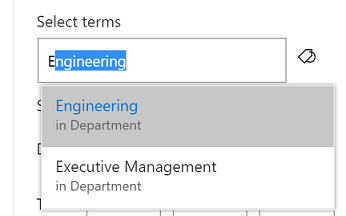
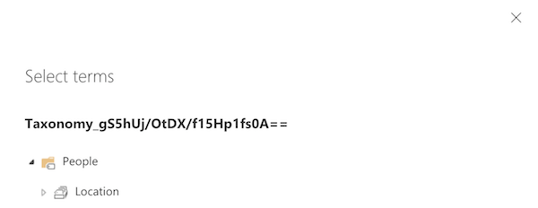

# PropertyFieldEnterpriseTermPicker control

This control generates a term picker that can be used in the property pane of your SharePoint Framework web parts.

> **Disclaimer**: This control makes use of the `@pnp/sp-taxonomy` module to retrieve the managed metadata information. It leads to increase of the bundle/package size if the control is being used. Use the control for "enterprise" scenarios (large term stores with lots of objects) or if you need to request labels for terms.

**Empty term picker**


**Selecting terms**


**Selected terms in the panel**


**Empty term picker**


**Term picker: Auto Complete**



**Limit the term set to a specific group or termset**



## How to use this control in your solutions

1. Check that you installed the `@pnp/spfx-property-controls` dependency. Check out The [getting started](../#getting-started) page for more information about installing the dependency.
2. Import the following modules to your component:

```TypeScript
import { PropertyFieldEnterpriseTermPicker } from '@pnp/spfx-property-controls/lib/PropertyFieldEnterpriseTermPicker';
```

3. Create a new property for your web part, for example:

```TypeScript
import { IPickerTerms } from "@pnp/spfx-property-controls/lib/PropertyFieldEnterpriseTermPicker";

export interface IPropertyControlsTestWebPartProps {
  terms: IPickerTerms;
}
```

4. Add the custom property control to the `groupFields` of the web part property pane configuration:

```TypeScript
PropertyFieldEnterpriseTermPicker('terms', {
  label: 'Select terms',
  panelTitle: 'Select terms',
  initialValues: this.properties.terms,
  allowMultipleSelections: true,
  excludeSystemGroup: false,
  onPropertyChange: this.onPropertyPaneFieldChanged,
  properties: this.properties,
  context: this.context,
  onGetErrorMessage: null,
  deferredValidationTime: 0,
  limitByGroupNameOrID: 'People',
  limitByTermsetNameOrID: 'Location',
  key: 'termSetsPickerFieldId',
  includeLabels: true
})
```

## Implementation

The `PropertyFieldEnterpriseTermPicker` control can be configured with the following properties:

| Property | Type | Required | Description |
| ---- | ---- | ---- | ---- |
| label | string | yes | Property field label displayed on top. |
| panelTitle | string | yes | TermSet Picker Panel title. |
| disabled | boolean | no | Specify if the control needs to be disabled. |
| context | WebPartContext | yes | Context of the current web part. |
| initialValues | IPickerTerms | no | Defines the selected by default term sets. |
| allowMultipleSelections | boolean | no | Defines if the user can select only one or many term sets. Default value is false. |
| excludeSystemGroup | boolean | no | Indicator to define if the system Groups are exclude. Default is false. |
| limitByGroupNameOrID | string | no | Limit the term sets that can be used by the group name or ID. |
| limitByTermsetNameOrID | string | no | Limit the terms that can be picked by the Term Set name or ID. |
| hideTermStoreName | boolean | no | Specifies if you want to show or hide the term store name from the panel. |
| isTermSetSelectable | boolean | no | Specify if the term set itself is selectable in the tree view. |
| disabledTermIds | string[] | no | Specify which terms should be disabled in the term set so that they cannot be selected. |
| onPropertyChange | function | yes | Defines a onPropertyChange function to raise when the date gets changed. |
| properties | any | yes | Parent web part properties, this object is use to update the property value.  |
| key | string | yes | An unique key that indicates the identity of this control. |
| onGetErrorMessage | function | no | The method is used to get the validation error message and determine whether the input value is valid or not. See [this documentation](https://dev.office.com/sharepoint/docs/spfx/web-parts/guidance/validate-web-part-property-values) to learn how to use it. |
| deferredValidationTime | number | no | Control will start to validate after users stop typing for `deferredValidationTime` milliseconds. Default value is 200. |
| resolveDelay | number | no | The delay time in ms before resolving suggestions, which is kicked off when input has been changed. e.g. if a second input change happens within the resolveDelay time, the timer will start over. Only until after the timer completes will onResolveSuggestions be called. Default is 500. |
| includeLabels | boolean | no | Specifies if term labels should be loaded from the store.|

Interface `IPickerTerms`

| Property | Type | Required | Description |
| ---- | ---- | ---- | ---- |
| key | string | yes | The ID of the term |
| name | string | yes | The name of the term |
| path | string | yes | The path of the term |
| termSet | string | yes | The Id of the parent term set of the term |
| termSetName | string | no | The Name of the parent term set of the term |

## Differences between PropertyFieldEnterpriseTermPicker and PropertyFieldTermPicker

`PropertyFieldEnterpriseTermPicker` is implemented to be used for "enterprise" Term Stores with large amount of groups, terms sets, and terms. It loads term sets and terms on demand - only at the moment when specified group or term set has been expanded in the Term Store Tree.
To implement on-demand loading `PropertyFieldEnterpriseTermPicker` uses `@pnp/sp-taxonomy` module from `@pnp/pnpjs` library. It increases the size of a bundle when the control is used.
Additionaly, `PropertyFieldEnterpriseTermPicker` allows to request labels for the terms in the picker.

`PropertyFieldTermPicker` loads all the groups and term sets from the term service during the initial request. This approach fits most of the scenarios with small and medium number of objects in a term store. Besides that, `PropertyFieldTermPicker` does not use any additional libraries or modules to retrieve data from the taxonomy service which makes it much more lightweight option in comparison with `PropertyFieldEnterpriseTermPicker`. See [PropertyFieldTermPicker](./PropertyFieldTermPicker) for implementation details.

**We recommend to use `PropertyFieldTermPicker` control if you don't need on-demand loading or term labels**.


