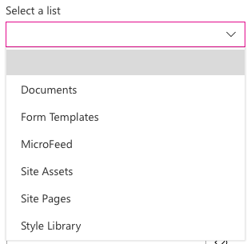
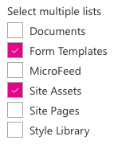

# PropertyFieldListPicker control

This control generates a list picker field that can be used in the property pane of your SharePoint Framework web parts.

The control can be configured as a single or multi-selection list picker:

**Single list picker**



**Multi list picker**




## How to use this control in your solutions

1. Check that you installed the `@pnp/spfx-property-controls` dependency. Check out The [getting started](../getting-started) page for more information about installing the dependency.
2. Import the following modules to your component:

```TypeScript
import { PropertyFieldListPicker, PropertyFieldListPickerOrderBy } from '@pnp/spfx-property-controls/lib/PropertyFieldListPicker';
```

3. Create a new property for your web part, for example:

```TypeScript
export interface IPropertyControlsTestWebPartProps {
  lists: string | string[]; // Stores the list ID(s)
}
```

4. Add the custom property control to the `groupFields` of the web part property pane configuration:

```TypeScript
PropertyFieldListPicker('lists', {
  label: 'Select a list',
  selectedList: this.properties.lists,
  includeHidden: false,
  orderBy: PropertyFieldListPickerOrderBy.Title,
  disabled: false,
  onPropertyChange: this.onPropertyPaneFieldChanged.bind(this),
  properties: this.properties,
  context: this.context,
  onGetErrorMessage: null,
  deferredValidationTime: 0,
  key: 'listPickerFieldId'
})
```

## Implementation

The `PropertyFieldListPicker` control can be configured with the following properties:

| Property | Type | Required | Description |
| ---- | ---- | ---- | ---- |
| label | string | yes | Property field label displayed on top. |
| disabled | boolean | no | Specify if the control needs to be disabled. |
| context | WebPartContext | yes | Context of the current web part. |
| selectedList | string OR string[] | no | Initial selected list set of the control. |
| baseTemplate | number | no | BaseTemplate ID of the lists or libaries you want to return. |
| includeHidden | boolean | no | Specify if you want to include hidden lists in the list picker. By default this is set to `true`. |
| orderBy | PropertyFieldListPickerOrderBy | no | Specify the property on which you want to order the retrieve set of lists. |
| multiSelect | boolean | no | Specify if you want to have a single or multi-list picker. By default this is set to `false` (single list picker). |
| onPropertyChange | function | yes | Defines a onPropertyChange function to raise when the date gets changed. |
| properties | any | yes | Parent web part properties, this object is use to update the property value.  |
| key | string | yes | An unique key that indicates the identity of this control. |
| onGetErrorMessage | function | no | The method is used to get the validation error message and determine whether the input value is valid or not. See [this documentation](https://dev.office.com/sharepoint/docs/spfx/web-parts/guidance/validate-web-part-property-values) to learn how to use it. |
| deferredValidationTime | number | no | Control will start to validate after users stop typing for `deferredValidationTime` milliseconds. Default value is 200. |

Enum `PropertyFieldListPickerOrderBy`

| Name | Description |
| ---- | ---- |
| Id | Sort by list / library ID |
| Title | Sort by list / library title |


