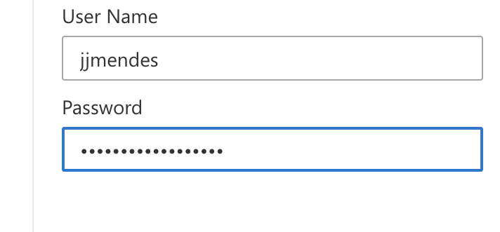

# PropertyFieldPassword control

This control generates an input field for password. Text is not visible .

**PropertyFieldPassword example usage**



## How to use this control in your solutions

- Check that you installed the `@pnp/spfx-property-controls` dependency. Check out The [getting started](../../#getting-started) page for more information about installing the dependency.
- Import the following modules to your component:

```TypeScript
import { PropertyFieldPassword } from '@pnp/spfx-property-controls/lib/PropertyFieldPassword';
```

- Create a new property for your web part, for example:

```TypeScript
export interface IPropertyControlsTestWebPartProps {
  password: string;
}
```

- Add the custom property control to the `groupFields` of the web part property pane configuration:

```TypeScript
PropertyFieldPassword("password", {
  key: "password",
  label: "password",
  value: this.properties.password,
  onChanged :  (value: string) => {
     console.log(value);
  }
})
```


## Implementation

The `PropertyFieldPassword` control can be configured with the following properties:

| Property | Type | Required | Description |
| ---- | ---- | ---- | ---- |
| key | string | yes | An unique key that indicates the identity of this control. |
| label | string | no | Property field label displayed on top. |
| value | number | no | Value to be displayed in the number field. |
| onChanged | (value: string) => void | no | If set, this method is used to get the the input value |


