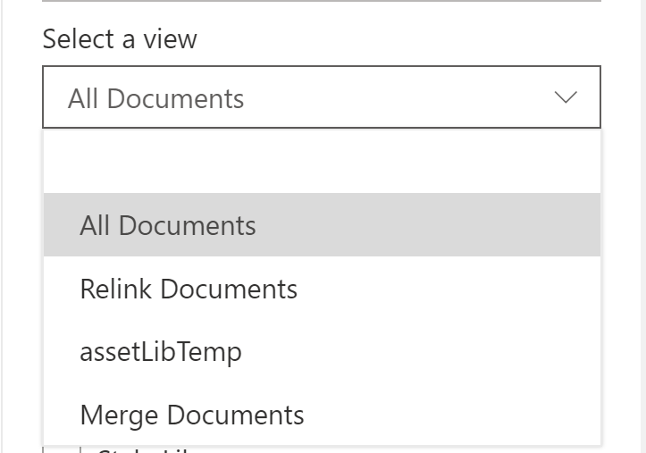

# PropertyFieldViewPicker control

This control generates a view picker field that can be used in the property pane of your SharePoint Framework web parts.

The control automatically retrieves the views for a given SharePoint list:



## How to use this control in your solutions

1. Check that you installed the `@pnp/spfx-property-controls` dependency. Check out The [getting started](../../#getting-started) page for more information about installing the dependency.
2. Import the following modules to your component:

```TypeScript
import { PropertyFieldViewPicker, PropertyFieldViewPickerOrderBy } from '@pnp/spfx-property-controls/lib/PropertyFieldViewPicker';
```

3. You'll probably want to use this control in combination with the [PropertyFieldListPicker](./PropertyFieldListPicker.md). Make sure to select the `multiSelect` prop to `false`, as this control is designed to work with a single list. Store the list id in your web part properties, as follows:
```TypeScript
export interface IPropertyControlsTestWebPartProps {
  list: string; // Stores the list ID
}
```

3. Create a new property for your web part, as indicated between the `BEGIN:` and `END:` comments below:

```TypeScript
export interface IPropertyControlsTestWebPartProps {
  list: string; // Stores the list ID

  // BEGIN: Added
  view: string; // Stores the view ID
  // END: Added
}
```

4. Add the custom property control to the `groupFields` of the web part property pane configuration:

```TypeScript
PropertyFieldViewPicker('view', {
  label: 'Select a view',
  listId: this.properties.list,
  selectedView: this.properties.view,
  orderBy: PropertyFieldViewPickerOrderBy.Title,
  disabled: false,
  onPropertyChange: this.onPropertyPaneFieldChanged.bind(this),
  properties: this.properties,
  context: this.context,
  onGetErrorMessage: null,
  deferredValidationTime: 0,
  key: 'viewPickerFieldId'
})
```

## Implementation

The `PropertyFieldViewPicker` control can be configured with the following properties:

| Property | Type | Required | Description |
| ---- | ---- | ---- | ---- |
| label | string | yes | Property field label displayed on top. |
| listId | string | yes | The ID of the list or library you wish to select a view from. |
| disabled | boolean | no | Specify if the control needs to be disabled. |
| context | WebPartContext | yes | Context of the current web part. |
| selectedView | string | no | Initial selected view of the control. |
| orderBy | PropertyFieldViewPickerOrderBy | no | Specify the property on which you want to order the retrieve set of views. |
| webAbsoluteUrl | string | no | Absolute Web Url of target site (user requires permissions) |
| onPropertyChange | function | yes | Defines a onPropertyChange function to raise when the date gets changed. |
| properties | any | yes | Parent web part properties, this object is use to update the property value.  |
| key | string | yes | An unique key that indicates the identity of this control. |
| onGetErrorMessage | function | no | The method is used to get the validation error message and determine whether the input value is valid or not. See [this documentation](https://dev.office.com/sharepoint/docs/spfx/web-parts/guidance/validate-web-part-property-values) to learn how to use it. |
| deferredValidationTime | number | no | Control will start to validate after users stop typing for `deferredValidationTime` milliseconds. Default value is 200. |
| viewsToExclude | string[] | no | Defines views by which should be excluded from the view picker control. You can specify view titles or IDs |
| filter | string | no | Filter views from OData query. |
| onViewsRetrieved | (views: ISPView[]) => PromiseLike<ISPView[]> \| ISPView[] | no | Callback that is called before the dropdown is populated. |


Enum `PropertyFieldViewPickerOrderBy`

| Name | Description |
| ---- | ---- |
| Id | Sort by view ID |
| Title | Sort by view title |


